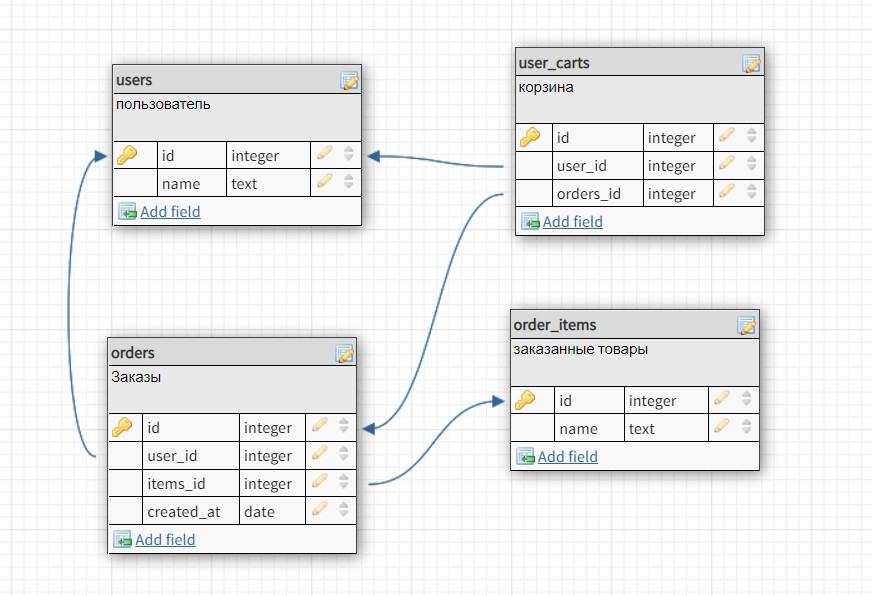

## postgresql

    CREATE TABLE "users" (
	"id" serial NOT NULL,
	"name" TEXT NOT NULL,
	CONSTRAINT "users_pk" PRIMARY KEY ("id")
    );

    CREATE TABLE "user_carts" (
    "id" serial NOT NULL,
    "user_id" integer NOT NULL,
    "orders_id" integer NOT NULL,
    CONSTRAINT "user_carts_pk" PRIMARY KEY ("id")
    );

    CREATE TABLE "orders" (
    "id" serial NOT NULL,
    "user_id" integer NOT NULL,
    "items_id" integer NOT NULL,
    "created_at" DATE NOT NULL,
    CONSTRAINT "orders_pk" PRIMARY KEY ("id")
    );

    CREATE TABLE "order_items" (
    "id" serial NOT NULL,
    "name" TEXT NOT NULL,
    CONSTRAINT "order_items_pk" PRIMARY KEY ("id")
    );

    ALTER TABLE "user_carts" ADD CONSTRAINT "user_carts_fk0" FOREIGN KEY ("user_id") REFERENCES "users"("id") ON DELETE CASCADE;
    ALTER TABLE "user_carts" ADD CONSTRAINT "user_carts_fk1" FOREIGN KEY ("orders_id") REFERENCES "orders"("id") ON DELETE CASCADE;
    
    ALTER TABLE "orders" ADD CONSTRAINT "orders_fk0" FOREIGN KEY ("user_id") REFERENCES "users"("id") ON DELETE CASCADE;
    ALTER TABLE "orders" ADD CONSTRAINT "orders_fk1" FOREIGN KEY ("items_id") REFERENCES "order_items"("id") ON DELETE CASCADE;
    
    INSERT INTO users (name) VALUES
    ('Пупкин И.И.'),
    ('Иванов В.В.'),
    ('Сидоров С.С.');
    
    INSERT INTO order_items (name) VALUES
    ('ПК'),
    ('Ноутбук'),
    ('Телефон');
    
    INSERT INTO orders (user_id, items_id, created_at ) VALUES
    (1,1,CURRENT_TIMESTAMP),
    (2,2,CURRENT_TIMESTAMP),
    (2,1,CURRENT_TIMESTAMP),
    (3,1,CURRENT_TIMESTAMP);
    
    INSERT INTO user_carts (user_id, orders_id) VALUES
    (1,1),
    (2,2),
    (2,3),
    (3,4);

Показать весь список:

    SELECT users.id , users.name , orders.id , order_items.id, order_items.name, orders.created_at
    FROM users, orders, order_items;

Удаление пользователя и всех связанных с ним данные:

	DELETE FROM users WHERE id = 1 RETURNING *;

## Laravel
Использовал:
<li>Docker Desktop</li>
<li>PhpStorm 2022.2.3</li>

Запуск: 
    
    docker-compose up --build  

Проверка:

    http://localhost:8190/users/{id}

